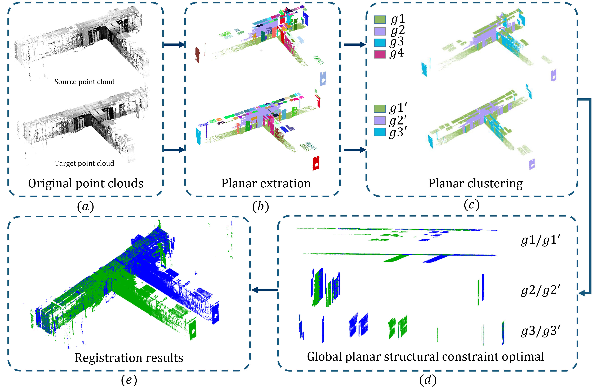

# GPSCO

## GPSCO: Global Planar Structural Constraint Optimal based point cloud registration algorithm for repetitive structures



---

### Build

#### Requirement

    * cmake(>=3.20)
    * PCL(>=1.12)
    * spdlog(1.12.0)

#### Option 1(shell)

* On Linux

 ```
    cd ${GPSCO_DIR}
    mkdir build
    cd build
    cmake ..
    make
```

* On Windows with Microsoft Visual Studio, use the x64 Native Tools Command Prompt for VS XXXX, then

```
    cd ${GPSCO_DIR}
    mkdir build
    cd build
    cmake -G "NMake Makefiles" ..
    nmake
```

#### Option 2(IDE)

Use any IDE that can directly handle CMakeLists files to open the CMakeLists.txt in the root directory of GPSCO. I recommend using [CLion](https://www.jetbrains.com/clion/).

---

### Usage

* On Linux

 ```
    ./example_regis  room_target.ply  room_source.ply  result.txt
```

---

### Benchmark Dataset

HS([Download Link1](https://drive.google.com/drive/folders/1OFHm4iSt0wIle2MeTROb93jYmVoc37mR?usp=sharing) And [Download Link2](https://pan.baidu.com/s/14ZvvR6qfYkQkbzvjEzspjg?pwd=lwcl)): Real-world Scans with Repetitive Structures. This dataset is part of the GPSCO work.

*Note:*

### Acknowledgments

We thank the respective authors for open sourcing their methods.

* [SC2-PCR](https://github.com/ZhiChen902/SC2-PCR)
* [Super4PCS](https://github.com/nmellado/Super4PCS)
* [PLADE](https://github.com/chsl/PLADE)
* [VPFBR](https://github.com/zhanjiawang/VPFBR-L)
